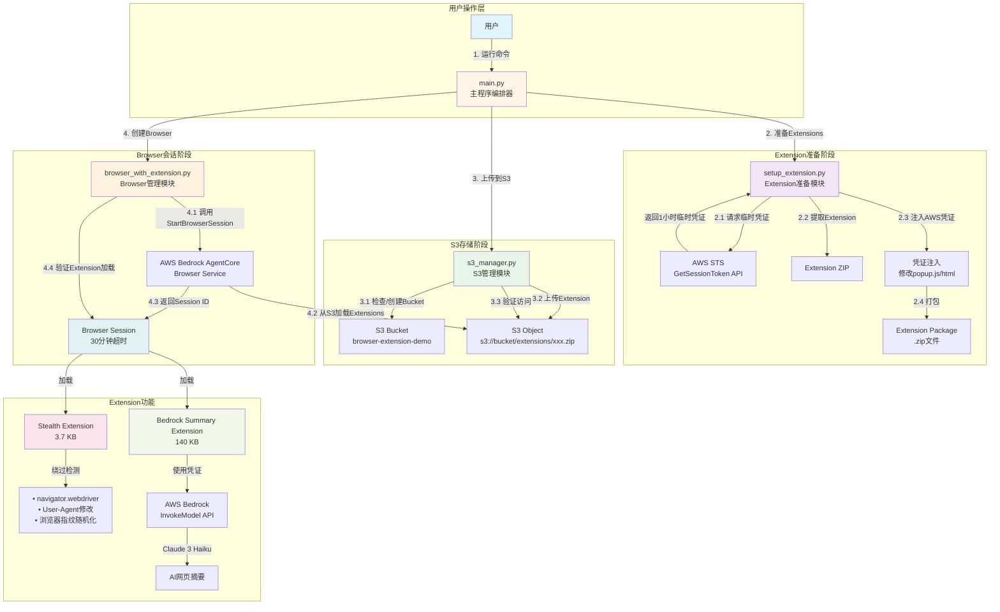
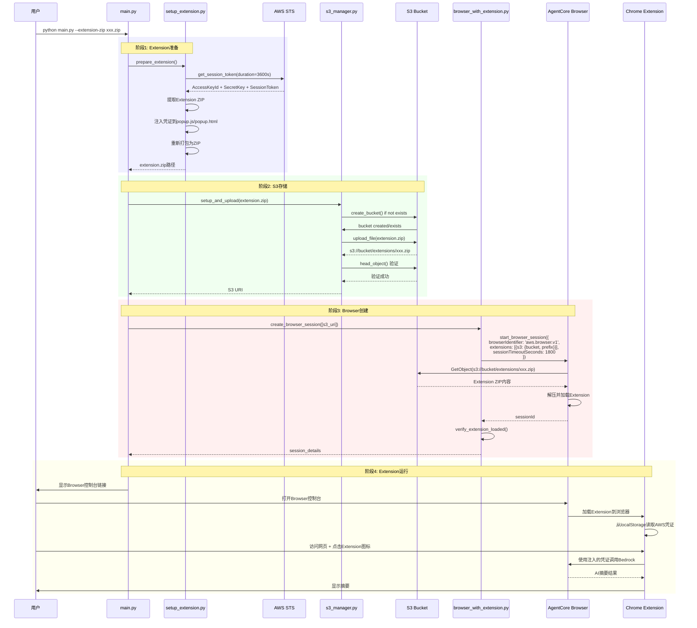
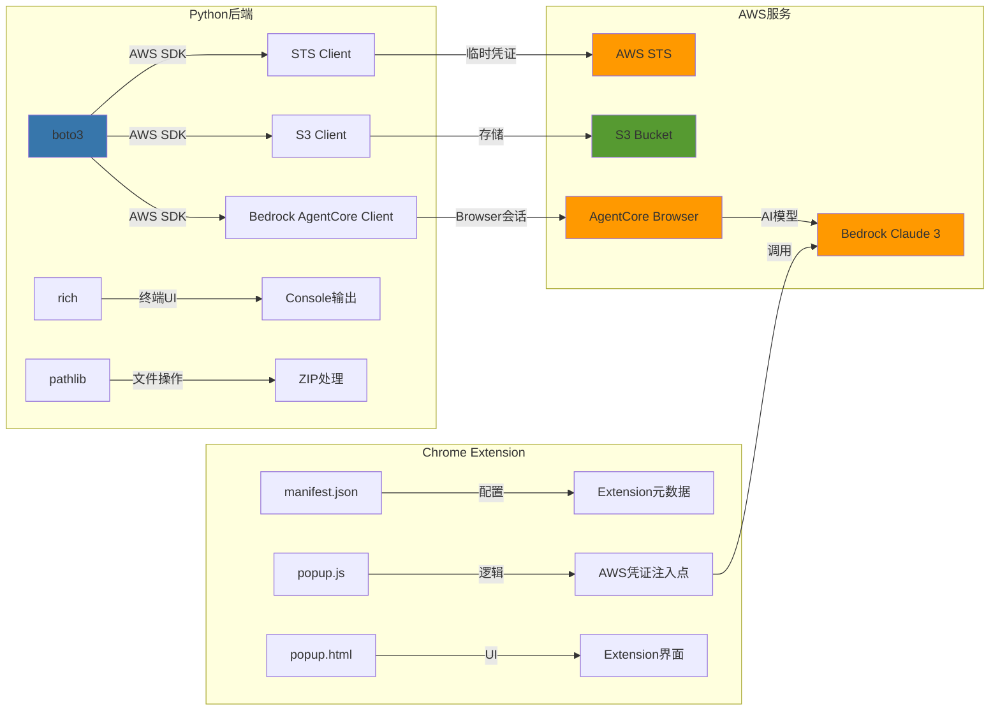
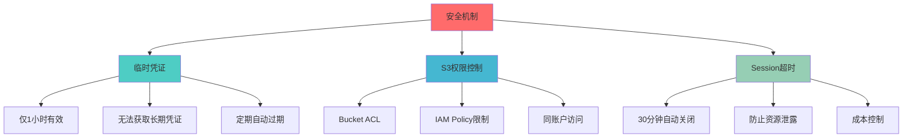

# AgentCore Browser + Chrome Extension 架构图

## 整体架构概览



## 详细技术实现流程



## 核心组件技术栈



## 数据流向图

```mermaid
flowchart TD
    subgraph "凭证流"
        A1[AWS IAM用户] -->|长期凭证| A2[STS GetSessionToken]
        A2 -->|临时凭证<br/>1小时有效| A3[注入到Extension]
        A3 -->|localStorage存储| A4[Extension运行时]
        A4 -->|调用Bedrock| A5[Claude 3 Haiku模型]
    end

    subgraph "Extension流"
        B1[Extension源码] -->|提取| B2[临时目录]
        B2 -->|凭证注入| B3[修改后的Extension]
        B3 -->|ZIP打包| B4[Extension.zip]
        B4 -->|上传| B5[S3 Object]
        B5 -->|引用| B6[Browser Session]
    end

    subgraph "Browser流"
        C1[start_browser_session API] -->|传入S3 URI| C2[AgentCore服务]
        C2 -->|下载Extension| C3[加载到Browser]
        C3 -->|用户访问| C4[网页内容]
        C4 -->|Extension处理| C5[提取文本]
        C5 -->|发送Bedrock| C6[AI摘要]
    end

    style A2 fill:#ff9900
    style A5 fill:#ff9900
    style B5 fill:#569a31
    style C2 fill:#ff9900
```



## Extension技术细节

### Stealth Extension (3.7 KB)

```javascript
// 核心功能实现
const stealthTechniques = {
  // 1. 覆盖navigator.webdriver
  webdriver: () => {
    Object.defineProperty(navigator, 'webdriver', {
      get: () => undefined
    });
  },

  // 2. 修改User-Agent
  userAgent: () => {
    Object.defineProperty(navigator, 'userAgent', {
      get: () => 'Mozilla/5.0 (Macintosh; Intel Mac OS X 10_15_7)...'
    });
  },

  // 3. 随机化浏览器指纹
  fingerprint: () => {
    // Canvas, WebGL, Audio指纹随机化
    // Plugins, Languages等随机化
  },

  // 4. 移除自动化headers
  headers: () => {
    // 移除 'HeadlessChrome', 'Chrome-Lighthouse' 等
  }
};
```

### Bedrock Summary Extension (140 KB)

```javascript
// AWS凭证自动配置
(function() {
  const credentials = {
    accessKeyId: '${AccessKeyId}',
    secretAccessKey: '${SecretAccessKey}',
    sessionToken: '${SessionToken}'
  };
  localStorage.setItem('keys', JSON.stringify(credentials));
})();

// 默认提取规则
const defaultRule = '<p>(.*?)</p>|<h[1-6]>(.*?)</h[1-6]>|<li>(.*?)</li>|<article>(.*?)</article>';

// Bedrock调用
const summaryContent = async (content) => {
  const response = await bedrockClient.invokeModel({
    modelId: 'anthropic.claude-3-haiku-20240307-v1:0',
    body: JSON.stringify({
      anthropic_version: 'bedrock-2023-05-31',
      messages: [{
        role: 'user',
        content: `请总结以下内容: ${content}`
      }],
      max_tokens: 1024
    })
  });
  return response;
};
```

## IAM权限要求

```yaml
Required IAM Permissions:
  STS:
    - sts:GetSessionToken  # 获取临时凭证

  S3:
    - s3:CreateBucket      # 创建bucket
    - s3:PutObject         # 上传extension
    - s3:GetObject         # 下载extension
    - s3:HeadObject        # 验证存在

  Bedrock AgentCore:
    - bedrock-agentcore:StartBrowserSession  # 创建browser
    - bedrock-agentcore:StopBrowserSession   # 关闭browser

  Bedrock:
    - bedrock:InvokeModel  # Extension调用Claude
```

## 限制与约束

| 限制项 | 具体值 | 说明 |
|--------|--------|------|
| Extension大小 | 最大10MB | 超过会导致加载失败 |
| Extensions数量 | 最多10个/session | API限制 |
| 临时凭证有效期 | 1小时 | STS GetSessionToken限制 |
| Session超时 | 30分钟 | 可配置，最长2小时 |
| S3 Bucket | 同账户 | 必须与Browser在同一AWS账户 |
| Region | 特定区域 | 不是所有region都支持AgentCore |

## 安全考虑



## 使用场景

1. **Web Scraping**: Stealth Extension绕过检测
2. **内容分析**: Bedrock Summary自动摘要
3. **自动化测试**: 真实浏览器环境测试
4. **AI辅助浏览**: 智能网页分析和总结
5. **企业内部工具**: 定制化Extension部署

## 扩展可能性

- 支持更多Extension类型（广告拦截、隐私保护等）
- 集成更多Bedrock模型（Claude Opus、Sonnet等）
- 添加Extension热更新机制
- 实现Extension版本管理
- 支持Extension配置动态更新
